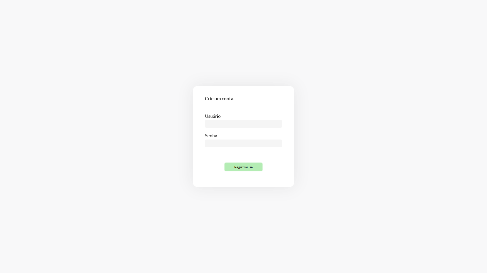
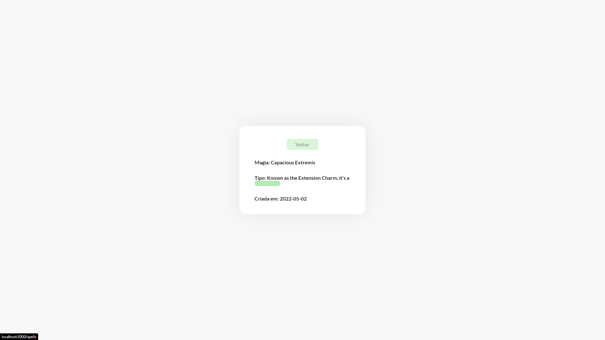
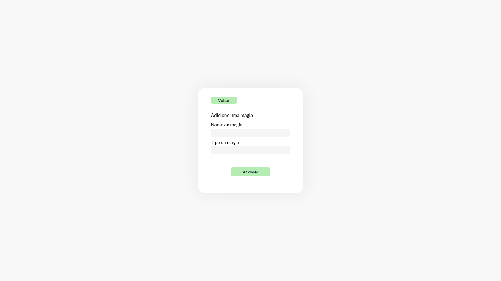
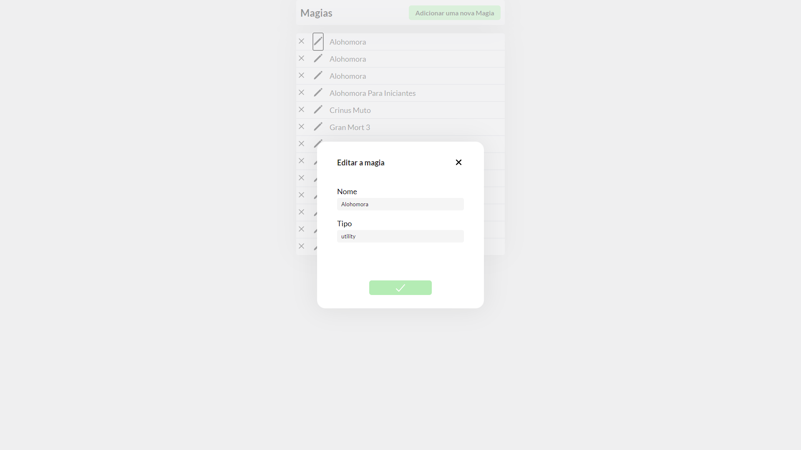

  <h1 align="center">Layout do Site</h1>
    
    
   
   
   

  <h1 align="center">Tecnologias utilizadas</h1>
  <ul>
    <li>JavaScript</li>  
    <li>Typescript</li>  
    <li>React.js</li> 
    <ul>
      <li>Axios</li>
      <li>React Icons</li>
      <li>SWR</li>
      <li>Styled Components</li>
      <li>React Router Dom</li>
    </ul>
 

 <h1 align="center">Autor</h1>
 <h3>Miguel Vianna Feiteira</h3>
 
Email: miguelviannafeiteira@gmail.com

 
Linkedin: https://www.linkedin.com/in/miguel-vianna-59950a219/

